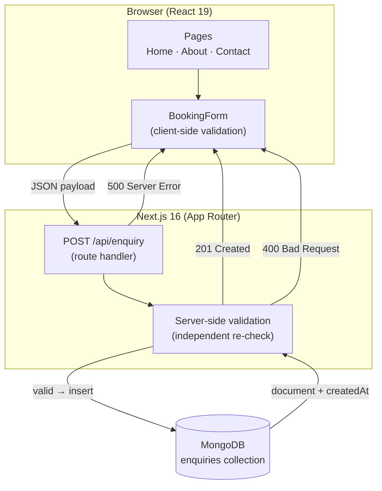
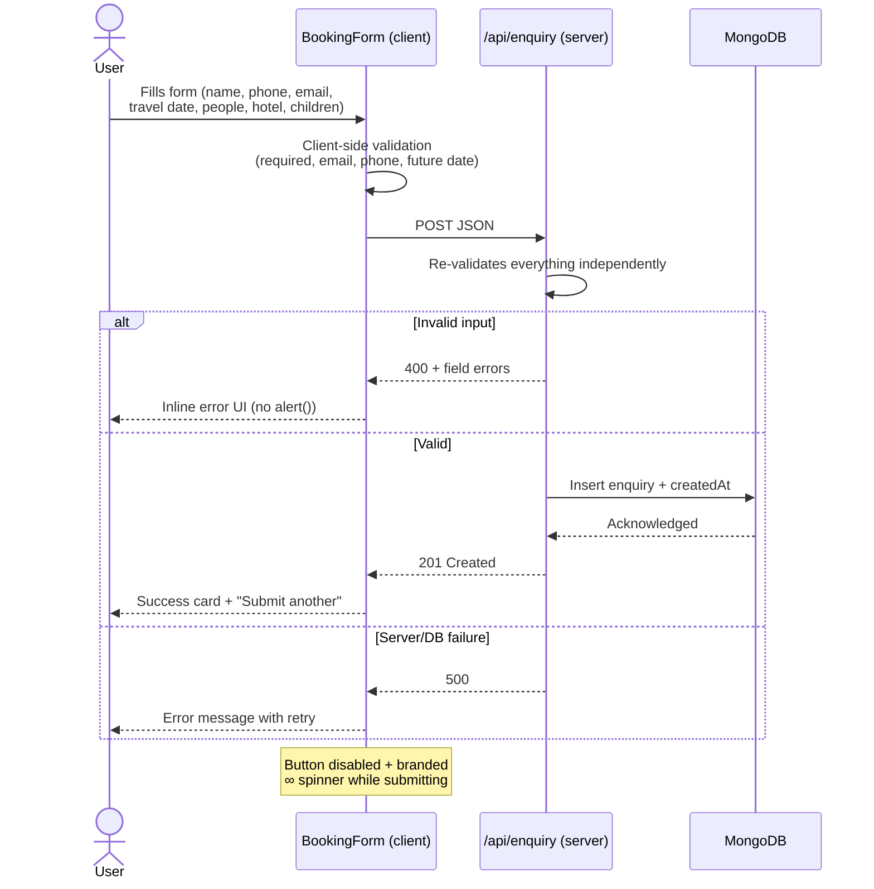

# Travel Unbounded

> India's Most Trusted Experiential Travel Experts — a full-stack travel enquiry website built with **Next.js 16** and **MongoDB**.

A responsive, production-style marketing + enquiry site: browse curated destinations (5 India, 5 International), learn about the company, and submit a trip enquiry that is validated on both the client and server before being persisted to MongoDB.

---

## / Architecture



## / Enquiry Data Flow



---

## / Features

- **Home page** — animated hero with brand CTA, 5 India + 5 International destination cards, branded page loader
- **About page** — company story, 3 office locations (Bengaluru, Kochi, Nairobi), "why choose us"
- **Contact page** — full booking enquiry form with dual-layer validation and branded loading spinner
- **API** — `POST /api/enquiry` with server-side validation, MongoDB persistence, and correct status codes (201 / 400 / 500)
- **Responsive** — mobile, tablet, and desktop layouts
- **SEO** — title + meta description on every page
- **UI** — custom design system (navy / parchment / amber / teal), Lucide icons, CSS animations

## Tech Stack

| Layer | Technology |
|---|---|
| Framework | Next.js 16 (App Router, Turbopack) |
| Language | TypeScript |
| UI | React 19, Tailwind CSS v4, Lucide React icons |
| Database | MongoDB via Mongoose |
| Fonts | Space Grotesk (display) + Inter (body) |

## Getting Started

### Prerequisites

- Node.js 18+
- A MongoDB instance (local or Atlas)

### Setup

1. **Clone the repository**
   ```bash
   git clone <repo-url>
   cd travel-unbounded
   ```

2. **Install dependencies**
   ```bash
   npm install
   ```

3. **Create your env file**
   ```bash
   cp .env.example .env.local
   ```

4. **Add your MongoDB connection string** to `.env.local`
   ```
   MONGODB_URI=mongodb://localhost:27017/travel-unbounded
   ```

5. **Run the dev server**
   ```bash
   npm run dev
   ```

6. Open [http://localhost:3000](http://localhost:3000)

### Production build

```bash
npm run build
npm start
```

## Environment Variables

| Variable | Description | Example |
|---|---|---|
| `MONGODB_URI` | MongoDB connection string (never hardcoded — read via `process.env`) | `mongodb://localhost:27017/travel-unbounded` |

`.env.local` holds real secrets and is **gitignored**. `.env.example` is committed with blank values as a template.

## API Reference

### `POST /api/enquiry`

Submits a travel enquiry.

**Request body (JSON)**

| Field | Type | Rules |
|---|---|---|
| `fullName` | string | required |
| `countryCode` | string | required (e.g. `+91`) |
| `contactNumber` | string | required, valid digits |
| `email` | string | required, valid email format |
| `dateOfTravel` | string (date) | required, **must be a future date** |
| `numberOfPeople` | number | required, ≥ 1 |
| `hotelCategory` | string | required, one of: `Standard`, `Deluxe`, `Luxury` |
| `numberOfChildren` | number | optional, ≥ 0 |

**Responses**

| Status | Meaning |
|---|---|
| `201` | Enquiry created and persisted (with `createdAt` timestamp) |
| `400` | Validation failed — returns per-field error details |
| `500` | Server or database error |

**Example**

```bash
curl -X POST http://localhost:3000/api/enquiry \
  -H "Content-Type: application/json" \
  -d '{
    "fullName": "Jane Doe",
    "countryCode": "+91",
    "contactNumber": "9876543210",
    "email": "jane@example.com",
    "dateOfTravel": "2026-12-10",
    "numberOfPeople": 2,
    "hotelCategory": "Deluxe",
    "numberOfChildren": 1
  }'
```

> Validation is **duplicated server-side** on purpose: an API client (curl/Postman) bypassing the form still gets rejected with a `400`.

## Project Structure

```
app/
  page.tsx               # Home (Hero + destination sections + CTA)
  layout.tsx             # Root layout, fonts, page loader
  globals.css            # Tailwind theme, colors, animations
  about/page.tsx         # About (story, offices, why choose us)
  contact/page.tsx       # Contact (booking form)
  api/enquiry/route.ts   # POST endpoint — validate + persist
components/
  Navbar.tsx             # Glassmorphic sticky nav + mobile menu
  Hero.tsx               # Hero section with gradient CTAs
  DestinationCard.tsx    # Destination card with hover effects
  DestinationSection.tsx # Responsive card grid
  BookingForm.tsx        # Enquiry form (client validation + states)
  LoadingSpinner.tsx     # Branded ∞ spinner (sm/md/lg)
  PageLoader.tsx         # Full-screen branded loader on page load
  Footer.tsx             # Multi-column footer
data/
  destinations.ts        # Static destination data (India + International)
lib/
  mongodb.ts             # Mongo connection helper (cached)
models/
  Enquiry.ts             # Mongoose schema
```

## Design System

| Token | Value | Use |
|---|---|---|
| `navy` | deep navy | primary background / headings |
| `parchment` | warm off-white | light backgrounds, text on navy |
| `amber` / `gold` / `orange` | warm accents | CTAs, highlights, logo gradient |
| `teal` | brand secondary | links, success states, accents |

The brand mark is a gradient **∞** symbol (gold → orange → teal), reused in the navbar, footer, page loader, and form spinner.

## Assumptions & Skipped Features

- **Destination data and pricing are static/dummy** — no database or real pricing engine
- **Images are from Unsplash** (free, no attribution required)
- **Marketing copy and stats are illustrative** — "500+ trips planned", "10+ destinations", "3 offices worldwide" are placeholder numbers, not real data
- **Contact details are placeholders** — the email (`hello@travelunbounded.com`) and phone numbers shown on the site are invented, not real contact channels
- **No authentication, admin dashboard, payment gateway, or booking engine** — not implemented
- **No Redis, Kafka, microservices, AI chatbot, or complex search** — explicitly out of scope
- **No destination-details pages** — not required; cards link to the enquiry form

